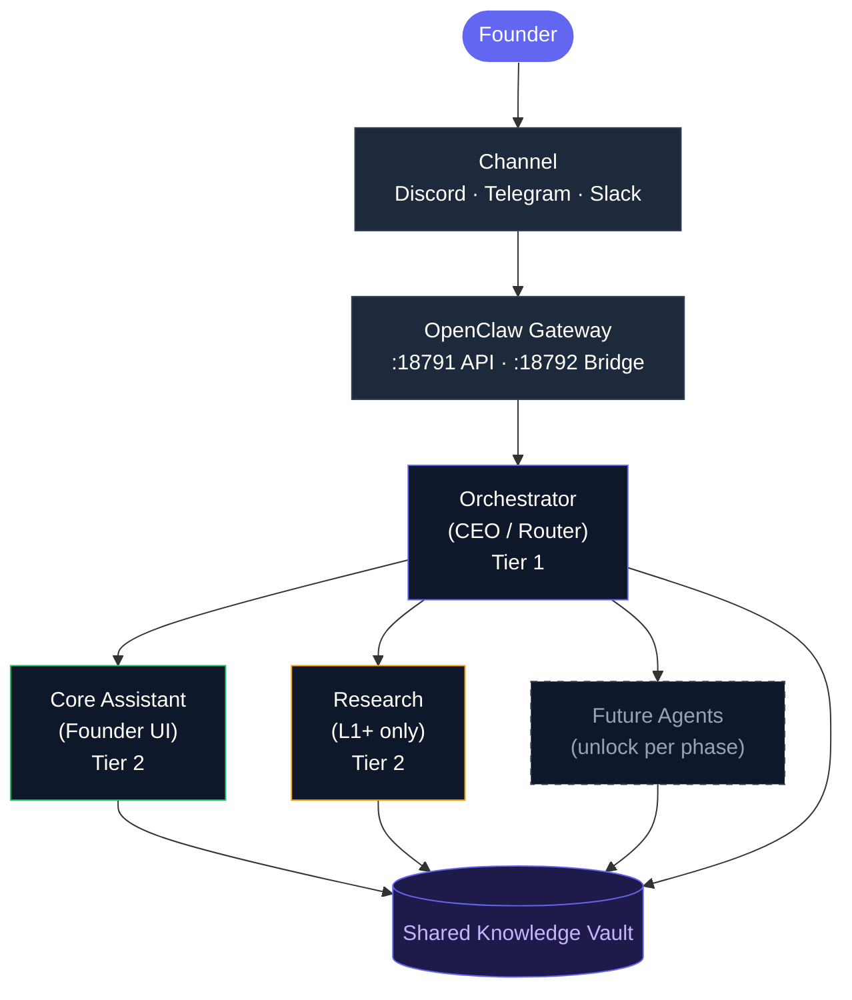
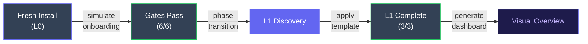
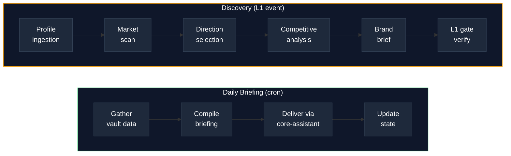
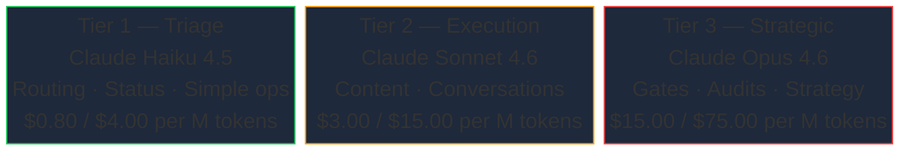

# AgentOrg

[](LICENSE)
[](https://docs.docker.com/get-docker/)
[](https://github.com/nicepkg/openclaw)

Progressive autonomous company framework built on [OpenClaw](https://github.com/nicepkg/openclaw). Start with two AI agents and a conversation. Scale to a full autonomous organization as your business grows.

## How It Works

AgentOrg is a configuration-driven agent framework. There is no frontend application — agents run inside an OpenClaw gateway container, read/write JSON files in a shared vault, and progress through phases as your business hits real milestones.



**Orchestrator** is the CEO — routes messages, enforces budgets, evaluates gates, manages phase transitions. **Core Assistant** is the founder's friendly interface — guides onboarding, delivers briefings, translates system state. **Research** activates at L1 to perform market scans and competitive analysis.

## Prerequisites

- **Docker** with Docker Compose v2
- **Python 3** (for scripts — dashboard generator, simulation, transitions)
- **OpenRouter API key** ([get one here](https://openrouter.ai/keys))
- **openssl** and **curl** (for setup)
- Docker image `openclaw:local` built from [OpenClaw source](https://github.com/nicepkg/openclaw)

## Quick Start

```bash
# 1. Build the OpenClaw image (if you haven't already)
cd /path/to/openclaw-src && docker build -t openclaw:local .

# 2. Run first-time setup (checks prereqs, creates .env, generates token, starts gateway)
./scripts/setup.sh

# 3. Add your OpenRouter API key to .env
#    OPENROUTER_API_KEY=sk-or-...

# 4. Restart with your key
docker compose up -d

# 5. Verify everything is healthy
./scripts/health-check.sh

# 6. View the founder dashboard
./scripts/generate-dashboard.sh
```

The gateway control UI is at `http://localhost:18791`. The founder dashboard opens in your browser after generation.

## Example: Zero to L1 in 5 Minutes

This walkthrough takes you from a fresh install to your first phase transition — no live gateway needed.

```bash
# 1. Simulate a completed onboarding (populates vault with realistic founder data)
./scripts/simulate-onboarding.sh --simulate
```

```
Simulating completed onboarding...
  Writing founder profile (Sarah Chen, ML engineer, 15h/week)
  Writing onboarding state (9/9 sections complete)
  Writing phase state, economics, business direction...

Evaluating L0 Gate Criteria:
  ✅ founder_profile_complete    — 8/8 fields populated
  ✅ vision_defined              — "AI-powered content studio" (127 chars)
  ✅ success_criteria_set        — 3 criteria defined
  ✅ communication_prefs_set     — async preferred, quiet hours 22:00-08:00
  ✅ financial_baseline_set      — budget $5.00/day, runway noted
  ✅ channel_connected           — discord connected

Result: PASS (6/6 criteria met) — Ready for L1 transition
```

```bash
# 2. Check the gate status before transitioning
./scripts/phase-transition.sh --status
```

```
Current Phase: L0 (Onboarding)
Started: 2026-03-28
Gate Progress: 6/6 criteria passing
Transition History: (none)
```

```bash
# 3. Transition to L1 Discovery
./scripts/phase-transition.sh --transition
```

```
Evaluating L0 gate... PASS (6/6)
Creating backup... done (knowledge/backups/pre-L1-2026-03-28.tar.gz)
Transitioning L0 → L1...
  Updated phase-state.json (currentPhase: L1, phaseName: Discovery)
  Logged transition in history

✅ Phase transition complete: L0 → L1 (Discovery)
```

```bash
# 4. Apply a business template to fast-track L1
./scripts/apply-template.sh --list
```

```
Available templates:
  content-agency    Inkwell Studio — Content & marketing agency
  saas-micro        Shiplog — Micro-SaaS product
  consulting        Practical AI Partners — AI operations consulting
```

```bash
./scripts/apply-template.sh --apply saas-micro
```

```
Applying template: saas-micro (Shiplog)
  Writing direction.json... done
  Writing brand-brief.json... done
  Writing market-research.json... done

L1 Gate Progress: 3/3 criteria now satisfied
  ✅ direction_selected     — "Developer productivity micro-SaaS"
  ✅ brand_brief_complete   — Shiplog, "Ship logs, not excuses"
  ✅ market_research_done   — 4 findings, 85% confidence

Ready for L2 transition when live metrics are met.
```

```bash
# 5. Generate the dashboard to see everything at a glance
./scripts/generate-dashboard.sh
```

This opens a self-contained HTML dashboard showing phase status, gate progress, onboarding data, budget, and knowledge graph — all from the vault files the scripts just populated.



> **What just happened?** You simulated the entire founder onboarding, proved the L0 gate evaluator works, transitioned to L1, applied a business template that satisfies all L1 criteria, and generated a dashboard — all without starting the Docker container. When you're ready to go live, `docker compose up -d` starts the gateway and your agents pick up right where the vault state left off.

## Configuration

All environment variables are defined in `.env` (copy from `.env.example`):

| Variable | Required | Description |
|----------|----------|-------------|
| `OPENCLAW_GATEWAY_TOKEN` | Yes | Auth token for gateway API (auto-generated by setup.sh) |
| `OPENCLAW_GATEWAY_PORT` | No | Gateway API port on host (default: `18791`) |
| `OPENCLAW_BRIDGE_PORT` | No | Bridge port on host (default: `18792`) |
| `OPENROUTER_API_KEY` | Yes | Primary AI provider key ([openrouter.ai/keys](https://openrouter.ai/keys)) |
| `ANTHROPIC_API_KEY` | No | Optional direct Anthropic API key |
| `OLLAMA_BASE_URL` | No | Optional local Ollama endpoint |
| `DISCORD_BOT_TOKEN` | No | Discord bot token (enable with `scripts/enable-channel.sh`) |
| `TELEGRAM_BOT_TOKEN` | No | Telegram bot token (enable with `scripts/enable-channel.sh`) |
| `SLACK_BOT_TOKEN` | No | Slack bot token (when channels are enabled) |
| `AGENTORG_TIMEZONE` | No | Timezone for cron jobs (default: `UTC`) |
| `AGENTORG_DAILY_BUDGET` | No | Daily API spend limit in USD (default: `5.00`) |
| `AGENTORG_FOUNDER_NAME` | No | Your name (used in agent prompts) |

## Phase System

AgentOrg uses a progressive phase system. New agents and capabilities unlock as your business hits real milestones. The full L0 through L2 progression pipeline is implemented and tested end-to-end.

```mermaid
graph LR
    L0["L0\nOnboarding"] -->|"profile + vision\n+ channel"| L1["L1\nDiscovery"]
    L1 -->|"direction + brand\n+ research"| L2["L2\nPresence"]
    L2 -->|"100 followers\n5% engagement"| L3["L3\nFirst Revenue"]
    L3 -->|"$1 revenue\n1 customer"| L4["L4\nProduct-Market Fit"]
    L4 -->|"3x ROI\n15% repeat"| L5["L5\nScale Decision"]
    L5 -->|"proposal\napproved"| L6["L6\nAutonomous Ops"]

    style L0 fill:#6366f1,color:#fff,stroke:none
    style L1 fill:#6366f1,color:#fff,stroke:none
    style L2 fill:#334155,color:#fff,stroke:#6366f1
    style L3 fill:#334155,color:#fff,stroke:#6366f1
    style L4 fill:#334155,color:#fff,stroke:#6366f1
    style L5 fill:#334155,color:#fff,stroke:#6366f1
    style L6 fill:#334155,color:#fff,stroke:#6366f1
```



| Phase | Name | Gate Criteria | Agents |
|-------|------|---------------|--------|
| **L0** | Onboarding | Profile complete, vision defined, success criteria, comm prefs, financial baseline, channel connected | Orchestrator, Core Assistant |
| **L1** | Discovery | Direction selected, brand brief complete, market research done | + Research |
| **L2** | Presence | 100 followers, 5% engagement | + Content, Social |
| **L3** | First Revenue | $1 revenue, 1 paying customer | + Sales, Compliance |
| **L4** | Product-Market Fit | 3x revenue vs cost, 15% repeat | + Finance, Operations, Audit |
| **L5** | Scale Decision | Scaling proposal approved | + Strategy |
| **L6** | Autonomous Ops | Continuous health monitoring | All agents active |

### Working with Phases

```bash
# Check current phase and gate progress
./scripts/phase-transition.sh --status

# Evaluate gate criteria (dry-run, no state change)
./scripts/phase-transition.sh --check

# Transition to next phase (requires all gate criteria to pass)
./scripts/phase-transition.sh --transition

# Force transition (development/testing only)
./scripts/phase-transition.sh --force
```

## Founder Dashboard

A self-contained HTML dashboard generated from vault data. Shows phase status, gate progress, onboarding completion, budget breakdown, treasury, human tasks, knowledge graph entries, and briefing history.

```bash
# Generate and open the dashboard
./scripts/generate-dashboard.sh

# Output: dashboards/index.html (open in any browser)
```

The dashboard handles both empty state (fresh install) and populated state (mid-progression). Dark theme, responsive from 375px mobile to 1440px desktop.

## Onboarding Simulation

Test the full onboarding flow without a live gateway. Populates vault with realistic founder data and evaluates L0 gate criteria programmatically.

```bash
# Full simulation: populate + evaluate (default)
./scripts/simulate-onboarding.sh

# Just populate vault with completed onboarding data
./scripts/simulate-onboarding.sh --populate

# Partial data (5/9 sections complete, 3/6 gate criteria pass)
./scripts/simulate-onboarding.sh --partial

# Evaluate gate criteria against current vault state
./scripts/simulate-onboarding.sh --evaluate

# Reset vault to fresh-install state
./scripts/simulate-onboarding.sh --reset
```

## Business Templates

Three starter templates to fast-track through L1 Discovery. Each template pre-seeds direction, brand brief, and market research data — satisfying all 3 L1 gate criteria.

| Template | Brand | Description |
|----------|-------|-------------|
| `content-agency` | Inkwell Studio | Content & marketing agency |
| `saas-micro` | Shiplog | Micro-SaaS product |
| `consulting` | Practical AI Partners | AI operations consulting |

```bash
# List available templates
./scripts/apply-template.sh --list

# Preview a template
./scripts/apply-template.sh --preview content-agency

# Apply a template (writes to vault)
./scripts/apply-template.sh --apply content-agency

# Reset L1 business data
./scripts/apply-template.sh --reset
```

## Channel Configuration

Enable Discord or Telegram as inbound channels for the gateway.

```bash
# Check channel status
./scripts/enable-channel.sh --status

# Enable a channel (validates env var, updates gateway config)
./scripts/enable-channel.sh --enable discord
./scripts/enable-channel.sh --enable telegram

# Disable a channel
./scripts/enable-channel.sh --disable discord
```

After enabling, add the bot token to `.env` and restart the container with `docker compose up -d`.

## Workflow Pipelines

Agent workflows are defined as Lobster pipeline files in `workflows/`:



- **`daily-briefing.lobster`** — 8-step pipeline: gather vault data (phase, budget, tasks, knowledge) → compile briefing → deliver via core-assistant → update state. Cron-triggered, adapts content per phase (L0-L6).
- **`discovery.lobster`** — 7-step pipeline: founder profile ingestion → market scan → direction selection → competitive analysis → brand brief → L1 gate verification. Event-triggered on L1 transition.

## Model Tiers



## Skills

Skills are markdown specifications that define tool interfaces for agents. Agents follow the spec to read/write vault files — there is no code runtime; behavior is prompt-driven.

| Skill | Tools | Purpose |
|-------|-------|---------|
| `knowledge-graph` | kg_store, kg_read, kg_search, kg_list | Institutional memory: decisions, insights, lessons |
| `human-task-queue` | htq_create, htq_list, htq_complete, htq_digest | Founder task tracking with priorities and quiet hours |
| `progression-engine` | gate_evaluate, gate_report, phase_get, transition | Phase management and gate evaluation |
| `economics-engine` | econ_log_cost, econ_log_revenue, get_treasury, get_budget_status | Financial tracking and budget enforcement |

## Scripts Reference

| Script | Purpose |
|--------|---------|
| `scripts/setup.sh` | Interactive first-run configuration |
| `scripts/health-check.sh` | System health verification (exit code = failures) |
| `scripts/backup.sh` | Timestamped archive of knowledge + config + workspaces |
| `scripts/generate-dashboard.sh` | Generate founder status dashboard |
| `scripts/simulate-onboarding.sh` | Onboarding simulation and L0 gate evaluation |
| `scripts/phase-transition.sh` | Phase transition engine with gate evaluation |
| `scripts/apply-template.sh` | Business template application for L1 fast-track |
| `scripts/enable-channel.sh` | Channel configuration manager (Discord/Telegram) |

## Directory Structure

| Path | Purpose |
|------|---------|
| `config/` | Gateway config (`openclaw.json`), model tiers, progression, economics, schemas |
| `agents/orchestrator/workspace/` | CEO agent — routing, decisions, budget, phase management |
| `agents/core-assistant/workspace/` | Founder interface — conversations, onboarding, briefings |
| `agents/research/workspace/` | Market researcher — scans, direction analysis, brand support (L1+) |
| `skills/` | Skill specifications (knowledge-graph, human-task-queue, progression-engine, economics-engine) |
| `workflows/` | Lobster pipeline definitions (daily-briefing, discovery) |
| `knowledge/` | Shared vault — runtime JSON state for all agents |
| `dashboards/` | Generated HTML dashboards |
| `templates/` | Business-type starter templates (content-agency, saas-micro, consulting) |
| `scripts/` | Operational scripts (setup, health-check, backup, dashboard, simulation, transitions, templates, channels) |
| `smoke/` | Smoke tests (8 suites, 500+ checks) |

## Testing

```bash
# Run all tests (structure, config, schemas, scripts, and 8 smoke test suites)
./tests/run-all.sh
```

The test suite includes:
- **Structure validation** — required directories, files, workspace completeness
- **Config validation** — JSON syntax, required fields, agent registration
- **Schema validation** — vault file schema compliance
- **Script validation** — script existence, permissions, syntax
- **Smoke tests** — 8 end-to-end test suites covering dashboard generation, onboarding simulation, phase transitions, research agent integration, workflow definitions, business templates, channel configuration, and full lifecycle integration (L0 → L1 → L2)

## Troubleshooting

**Gateway won't start:**
- Check the image exists: `docker image inspect openclaw:local`
- Check logs: `docker compose logs agentorg-gateway`
- Verify `.env` has `OPENCLAW_GATEWAY_TOKEN` set

**Health check failures:**
- Run `./scripts/health-check.sh` — it shows actionable fix hints for each failure
- Ensure Docker is running: `docker info`
- Check gateway port isn't in use: `ss -tlnp | grep 18791`

**API key issues:**
- Verify your key in `.env` has no trailing spaces or quotes
- Test your key: `curl -H "Authorization: Bearer $OPENROUTER_API_KEY" https://openrouter.ai/api/v1/models | head`

**Container keeps restarting:**
- Check memory: the container has a 4GB limit. Run `docker stats agentorg-gateway`
- Check for config errors: `docker compose logs agentorg-gateway --tail 50`

**Dashboard shows stale data:**
- Re-run `./scripts/generate-dashboard.sh` — the dashboard is a static snapshot, not live-updating

## License

MIT
